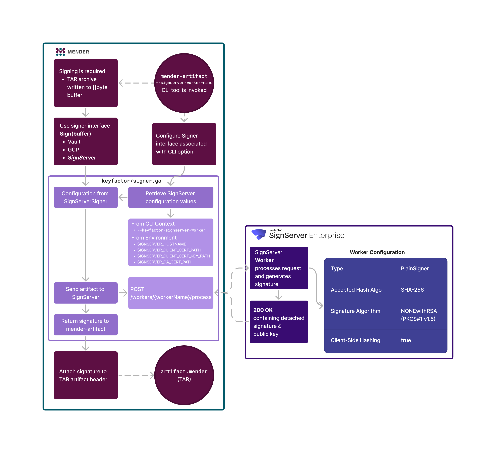

<a href="https://www.keyfactor.com/products/signserver-enterprise/">

</a>

# Keyfactor SignServer Signer for Mender Artifact

The Keyfactor SignServer Signer for Mender Artifact is a custom signer for the [Mender](https://mender.io) OTA update manager. It uses [Keyfactor SignServer](https://www.keyfactor.com/products/signserver-enterprise/) to sign Mender Artifacts.

Signing and Verification requests are forwarded to SignServer via the SignServer REST API, available in SignServer v6 and later.

Keyfactor SignServer enables organizations to automate the signing of Mender artifacts with a secure, auditable, and compliant process. PKI resources are stored in a secure, centralized location, and signing operations are performed by a dedicated signing service. This ensures that signing keys are never exposed to the Mender server. Additionally, SignServer enables compliance with internal IT policy by enforcing access policies.



## Requirements

* [Keyfactor SignServer](https://www.keyfactor.com/products/signserver-enterprise/) 6.0 or later
  * [Keyfactor SignServer Community Edition](https://www.signserver.org/) is also supported after version 6.0

## SignServer Configuration

The SignServer Signer for Mender Artifact requires a SignServer PlainSigner worker. The worker must be configured with the following properties:

| Property                          | Value                                         |
|-----------------------------------|-----------------------------------------------|
| `ACCEPTED_HASH_DIGEST_ALGORITHMS` | `SHA-256, SHA-384, SHA-512`                   |
| `AUTHTYPE`                        | `NOAUTH`                                      |
| `CRYPTOTOKEN`                     | `CryptoTokenP12`                              |
| `DEFAULTKEY`                      | `signer00003`                                 |
| `DISABLEKEYUSAGECOUNTER`          | `true`                                        |
| `DO_LOGREQUEST_DIGEST`            |                                               |
| `IMPLEMENTATION_CLASS`            | `org.signserver.module.cmssigner.PlainSigner` |
| `LOGREQUEST_DIGESTALGORITHM`      |                                               |
| `NAME`                            | `MenderPlainSigner`                           |
| `SIGNATUREALGORITHM`              | `NONEwithRSA`                                 |
| `TYPE`                            | `PROCESSABLE`                                 |
| `CLIENTSIDEHASHING`               | `true`                                        |

## Usage

Authentication with the SignServer REST API is performed using a client certificate. The client certificate must be a PEM encoded X509v3 certificate with an unencrypted private key in PKCS#8 format. The certificate and private key can be stored in the same file or in separate files. The certificate and private key must be stored in a directory accessible to the context in which the signer is invoked. The following environment variables can be used to configure the signer:

| Environment Variable              | Description                                                                                                                                         | Required |
|-----------------------------------|-----------------------------------------------------------------------------------------------------------------------------------------------------|----------|
| `SIGNSERVER_HOSTNAME`             | The host name of the SignServer instance to use for signing.                                                                                        | ✅        |
| `SIGNSERVER_CLIENT_CERT_PATH`     | The path to the client certificate used to authenticate with the SignServer REST API.                                                               | ✅        |
| `SIGNSERVER_CLIENT_CERT_KEY_PATH` | The path to the private key for the client certificate. The signer will recognize if the private key is in the same file as the client certificate. |          |
| `SIGNSERVER_CA_CERT_PATH`         | The path to the root CA certificate (and any intermediates) used to verify the SignServer server certificate, if it wasn't signed by a trusted CA.  |          |

To use the SignServer Signer for Mender Artifact, invoke the Mender Artifact CLI with the `--keyfactor-signserver-worker` option:

```shell
mender-artifact sign <artifact-path> --keyfactor-signserver-worker <keyfactor-signserver-worker>
```